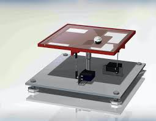

# MECHA482-ReactionWheel
# Group 2
Ball on Plate project for MECA 482 at CSU Chico.

-------------------------------------------------------------------------------------

Ball on Plate

Project Members:
TaylorAnne Brown - 
Jeremy Mills -
Jacob Grout -
Ana Delgado
      
 

-------------------------------------------------------------------------------------

  

   <h4> California State University Chico</h4>
   <h4> College of Engineering, Computer Science, and Construction Management</h4> 
   <h4> MECA 482 Control Systems</h4> 
   <h4> Ball on Plate</h4> 

#### Table of Contents
- [1. Introduction](#1-Introduction)
- [2. Linearized Model](#2-Linearized_Model)
- [3. Appendix](#3-Appendix)
- [4. References](#4-References)

## 1. Introduction 
The objective of this project is to develop a plate that is able to ballance a ball. This system will need to be able to correct for any movement the ball causes. 

## 2. LinearizedModel

All of the following is in respect to the x-direction. For the ball to be in stationary equilibrium, the momentum of the ball must match that of the force produced by gravity. The force produced by gravity is:

  

The force from the rotation of the ball:

  

Where bis the angle of the ball and rbis the radius of the ball. Using a sector formula, x(t) =b(t)rbwe can convert from angular to linear displacement. So the force on the ball from the momentum is:

  

So if:

  

Then solving for linear acceleration:

  

To relate this equation of motion that represents the position of the ball to the angle of the servo load gear we will first get the relationship between the servo angle and the beam angle. The sine of the servo shaft angle:

  

With this equation and the following we can obtain the relationship:

  

By combining Eq(5) and Eq(7):

  

To turn this nonlinear equation of motion approximate sinxs(t)xs(t) to get a linear equation:

  

## 3. Appendix

Examples

A1: Degree of Freedom Calculation: 
https://modernrobotics.northwestern.edu/nu-gm-book-resource/2-2-degrees-of-freedom-of-a-robot/

A2: Magni Mobile Robot Information: 
https://www.roboticsbusinessreview.com/robotic-company/directory/listings/ubiquity-robotics/

## 4. References

Examples

[1] Lynch, K., &amp; Park, F. C. (2019). Modern robotics: Mechanics, planning, and control. Cambridge, United Kingdom: Cambridge University Press.

[2] Kitagawa, Hiroki, et al. "Effectiveness of 222-nm ultraviolet light on disinfecting SARS-CoV-2 surface contamination." American journal of infection control (2020).

<a href="https://github.com/janso2000/MECHA470_Mobile_Sanitation_Robot"> Click here to go to our project repository </a>
