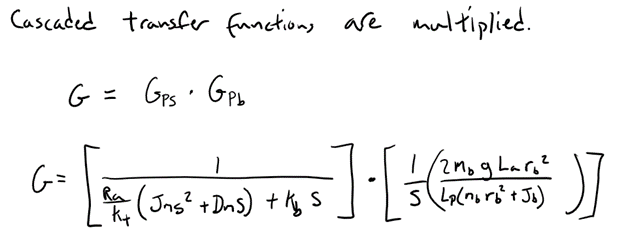

# MECA482-Ball on Plate
# Group 2
Ball on Plate project for MECA 482 at CSU Chico.

-------------------------------------------------------------------------------------

Ball on Plate

Project Members:
TaylorAnne Brown - 
Jeremy Mills -
Jacob Grout -
Ana Delgado
      
 

-------------------------------------------------------------------------------------

  

   <h4> California State University Chico</h4>
   <h4> College of Engineering, Computer Science, and Construction Management</h4> 
   <h4> MECA 482 Control Systems</h4> 
   <h4> Ball on Plate</h4> 

#### Table of Contents
- [1. Introduction](#1-Introduction)
- [2. Equations](#2-Equations)
- [3. Code](#3-Code)
- [4. Simulink](#4-Simulink)
- [5. Appendix](#5-Appendix)
- [6. References](#6-References)

## 1. Introduction 
The objective of this project is to develop a plate that is able to ballance a ball. This system will need to be able to correct for any movement the ball causes. 

## 2. Equations

All of the following is in respect to the x-direction. For the ball to be in stationary equilibrium, the momentum of the ball must match that of the force produced by gravity. The force produced by gravity is:

  

The force from the rotation of the ball:

  

Where bis the angle of the ball and rbis the radius of the ball. Using a sector formula, x(t) =b(t)rbwe can convert from angular to linear displacement. So the force on the ball from the momentum is:

  

So if:

  

Then solving for linear acceleration:

  

To relate this equation of motion that represents the position of the ball to the angle of the servo load gear we will first get the relationship between the servo angle and the beam angle. The sine of the servo shaft angle:

  

With this equation and the following we can obtain the relationship:

  

By combining Eq(5) and Eq(7):

  

To turn this nonlinear equation of motion approximate sinxs(t)xs(t) to get a linear equation:

  

Using this governing equation, we can transform this into an equations in MATLAB or Simulink

  

  

  

  

  

  

## 3. Code 

 For the design of our system a 6% overshoot and a settling time of 3 seconds. By using these criteria and the equations {Need Equations} the natural frequency &omega;n and the dampening ratio &zeta;. In order to find the poles and the gain of the system Root Locus was used. The values of the Natural frequency and dampening ratio were used to build the rootlocus graph as seen in figure 1. The area between the dotted diagnals is where there is less than 5% overshoot, and the area to left of the curved dotted region is the area of less than a 3 second settling time. Because none of the plot falls within this design criteria a lead compensator was used. I order to pull the Root locus more to the left-hand plane a zero close to the origin and a pole out at -4 were used. The results of this can be seen in figure 2. Finally by utilizing the function rlocfind() a location of the Root Locus graph within the design parameters can be chosen in order to find the gain of the system the results of this can be found in Figure 3.

 

  

  Figure 1. Graph of Root Locus utilizing the systems natural frequency and dapening ratio

  

  Figure 2. Location of the poles within the design criteria

  

  Figure 3. Output of the Rlocfind() giving a gain, K, equal to 22.34

## 4. Simulink

 In order to determine if our new pole and gain values actually help us to achieve our desired response of 6% overshoot with a 3 second settling time, a Simulink model needed to be developed. The first model needed to be a model of the system in which we could apply an angle, &theta;, to the system and get a ball position, x , as an output. This model can be seen below. 
      

      

  

  Figure 5. Complete model of system with nonlinear Lagrangian equation of motion

 With a model developed and our new: Gain, Zero and Pole can be implemented into a closed loop response based off our system. This closed loop response is also what will be outputing our &theta; value to the coppelia model as well as recieving our measure x position of the ball. In order to test if our system will have a proper response the closed loop system is attached to our system as seen in Figure 6. The response to a step input can be seen in figure 7. and shows that we've corrected our systems unstable response.

  

  Figure 6. Closed loop response

  

  Figure 7. Controlled response of our system

## 5. Appendix

Examples

A1: Degree of Freedom Calculation: 
https://modernrobotics.northwestern.edu/nu-gm-book-resource/2-2-degrees-of-freedom-of-a-robot/

A2: Magni Mobile Robot Information: 
https://www.roboticsbusinessreview.com/robotic-company/directory/listings/ubiquity-robotics/

## 6. References

Examples

[1] Lynch, K., &amp; Park, F. C. (2019). Modern robotics: Mechanics, planning, and control. Cambridge, United Kingdom: Cambridge University Press.

[2] Kitagawa, Hiroki, et al. "Effectiveness of 222-nm ultraviolet light on disinfecting SARS-CoV-2 surface contamination." American journal of infection control (2020).

<a href="https://github.com/janso2000/MECHA470_Mobile_Sanitation_Robot"> Click here to go to our project repository </a>
